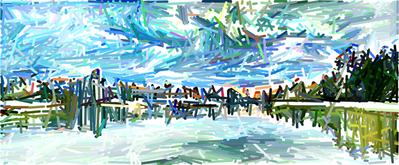

  
# Differentiable Drawing and Sketching

This repository contains the __official__ implementation of the paper ['Differentiable Drawing and Sketching.'](https://arxiv.org/abs/2103.16194)

  <a href="https://arxiv.org/abs/2103.16194">ArXiv</a> •
  <a href="https://paperswithcode.com/paper/differentiable-drawing-and-sketching">Papers With Code</a> •
  <a href="#about">About</a> •
  <a href="#usage">Usage</a> •
  <a href="#experiments">Experiments</a> 

</a>

## About

This is a bottom-up relaxed differentiable relaxation of point/line/curve rasterisation and sketch generation implemented entirely as GPU-accelerated tensor operations in [PyTorch](http://pytorch.org). We relax the act of rasterising primitive objects such that there is a gradient with respect to the primitive's parameters from every pixel in the image. Rasterisations of primitives can then be composed in different ways (so long as they are differentiable) to achieve a resultant output which can be optimised. 

We demonstrate that it is possible to perform gradient descent directly through the rasteriser to make the generated image match a target image according to some loss (which could be a simple function, or even a complex neural network -- the image above was created using the [LPIPS Perceptual Loss with a VGG16 network](https://github.com/richzhang/PerceptualSimilarity) to optimise 2000 straight line segments and their respective colours). We also demonstrate the use of the rasteriser in auto-encoder models that learn to both produce reconstructions whilst simultaneously learning the actual parameters of underlying vector primitives, and thus differentiably perform [automatic image tracing (aka autotracing)](https://en.wikipedia.org/wiki/Image_tracing).

## Usage

### Installation

Clone the source, then from the source directory install the dependencies (`pip install -r requirements.txt`) and run `python setup.py install` to install the library and commandline tools.

### Demonstration Notebooks

The [samples/](samples/) directory contains a number of jupyter notebooks demonstrating how to implement different types of primitive parameterisations, as well as demonstrating direct optimisation of primitive parameters using gradient descent through the rasteriser.

### Tools

We've provided some simple commandline tools to perform image optimisation and run experiments from the paper.

#### Image Optimisation

The `imageopt` tool lets you optimise an image against a set of points and line segments:

    usage: imageopt [--width WIDTH] [--lines LINES] [--points POINTS] --loss
                {BCELoss,BlurredMSELoss,DoGPyrMSELoss,LPIPSLoss,MSELoss,PyrMSELoss}
                [--iters ITERS] [--init-sigma2 INIT_SIGMA2]
                [--final-sigma2 FINAL_SIGMA2] [--sigma2-factor SIGMA2_FACTOR]
                [--sigma2-step SIGMA2_STEP] [--seed SEED] [--lr LR]
                [--init-raster INIT_RASTER] [--init-pdf INIT_PDF]
                [--final-raster FINAL_RASTER] [--final-pdf FINAL_PDF]
                [--snapshots-path SNAPSHOTS_PATH]
                [--snapshots-steps SNAPSHOTS_STEPS] [--invert]
                [--optimiser OPTIMISER] [--device DEVICE] [--colour]
                image

For example, the image at the top of this page was created with:

	imageopt --loss LPIPSLoss --net vgg --invert --seed 1234 --width 300 --lines 2000 --init-sigma2 1.0 --final-sigma2 1.0 --iters 500 --lr 0.01 --init-raster results/vancouver/init.png --final-raster results/vancouver/final.png --init-pdf results/vancouver/init.pdf --final-pdf results/vancouver/final.pdf --snapshots-path results/vancouver data/vancouver.jpg --snapshots-steps 100 --colour

#### Auto-encoder Experiments

The auto-encoder experiments in the paper can be reproduced with the `autoencoder-experiment` tool, which has a `train` mode for model training:

    autoencoder-experiment train [-h] [--variational] --encoder
                                    {BetterCNNEncoder,Conv2DEncoder,SimpleCNNEncoder,SimpleMLPEncoder,StrokeNetEncoder}
                                    --decoder
                                    {RNNBezierDecoder,RecurrentCRSDecoder,RecurrentDecoder,RecurrentPolyConnectDecoder,RecurrentPolyLineDecoder,RecurrentSimpleLineDecoder,SinglePassBezierConnectDecoder,SinglePassCRSDecoder,SinglePassPolyConnectDecoder,SinglePassPolyLineDecoder,SinglePassSimpleBezierDecoder,SinglePassSimpleLineDecoder}
                                    --dataset
                                    {C28pxOmniglot,MNIST,Omniglot,ScaledMNIST}
                                    [--num-reconstructions NUM_RECONSTRUCTIONS]
                                    --output OUTPUT [--device DEVICE] --loss
                                    {BCELoss,BlurredMSELoss,DoGPyrMSELoss,LPIPSLoss,MSELoss,PyrMSELoss}
                                    [--epochs EPOCHS]
                                    [--learning-rate LEARNING_RATE]
                                    [--weight-decay WEIGHT_DECAY]
                                    [--snapshot-interval SNAPSHOT_INTERVAL]

and an `eval` mode for evaluating:

    autoencoder-experiment eval [-h] [--variational] --encoder
                                   {BetterCNNEncoder,Conv2DEncoder,SimpleCNNEncoder,SimpleMLPEncoder,StrokeNetEncoder}
                                   --decoder
                                   {RNNBezierDecoder,RecurrentCRSDecoder,RecurrentDecoder,RecurrentPolyConnectDecoder,RecurrentPolyLineDecoder,RecurrentSimpleLineDecoder,SinglePassBezierConnectDecoder,SinglePassCRSDecoder,SinglePassPolyConnectDecoder,SinglePassPolyLineDecoder,SinglePassSimpleBezierDecoder,SinglePassSimpleLineDecoder}
                                   --dataset
                                   {C28pxOmniglot,MNIST,Omniglot,ScaledMNIST}
                                   [--num-reconstructions NUM_RECONSTRUCTIONS]
                                   --output OUTPUT [--device DEVICE] --weights
                                   WEIGHTS
                                   [--classifier-weights CLASSIFIER_WEIGHTS]
                                   [--classifier-model {LakeThesisCNN,MnistCNN,OmniglotCNN,ScaledMnistCNN}]

The evaluation mode requires a pretrained classifier for measuring performance. We've provided our MNIST and Scaled-MNIST classifiers in the [expt-models](expt-models) folder. However, you can train your own classifiers with the provided `train_classifiers` tool.

## Citation

If you find this repository useful for your research, please use the following.

	@misc{mihai2021differentiable,
	      title={Differentiable Drawing and Sketching}, 
	      author={Daniela Mihai and Jonathon Hare},
	      year={2021},
	      eprint={2103.16194},
	      archivePrefix={arXiv},
	      primaryClass={cs.CV}
	}
